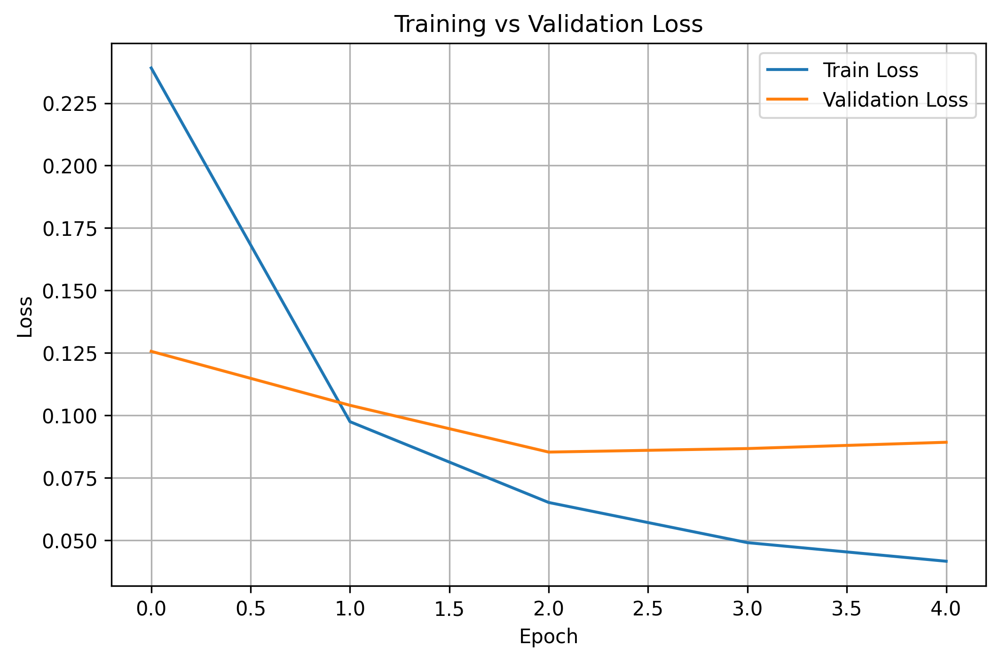
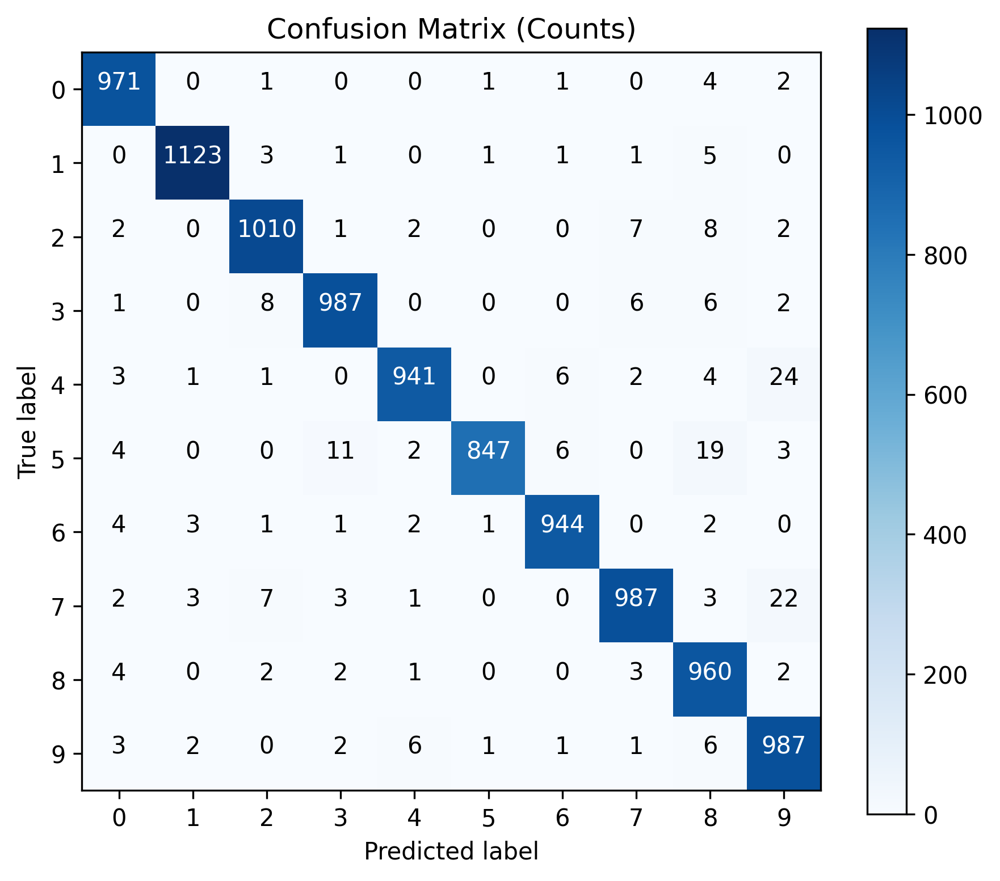
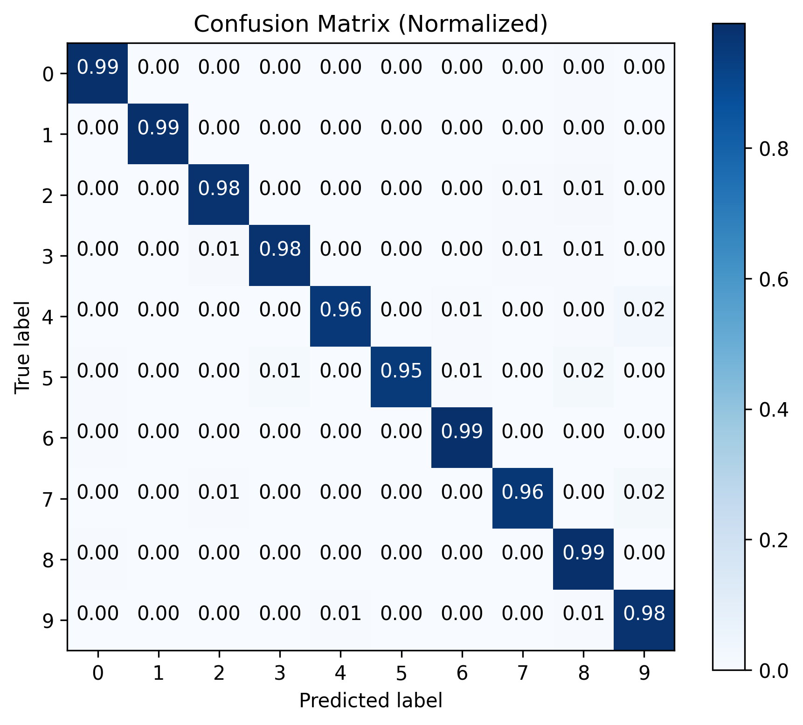
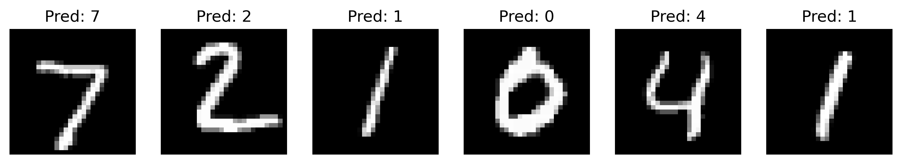
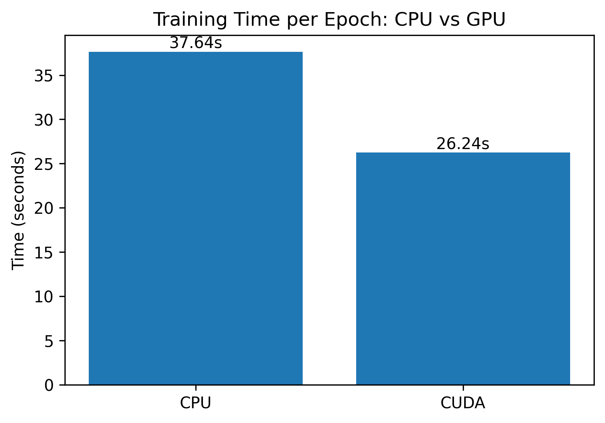

# MNIST Digit Classification using PyTorch (GPU Accelerated)

This repository contains a complete deep learning workflow for handwritten digit classification using the MNIST dataset and PyTorch, including GPU acceleration, training/validation curves, confusion matrices, detailed evaluation metrics, and a CPU vs GPU performance comparison.

This project is part of my journey transitioning from Data Analytics into Machine Learning / Deep Learning.

---

## Key Features

- Lightweight and readable PyTorch implementation
- GPU training (NVIDIA RTX 4070 Laptop GPU)
- Training/validation split with loss tracking
- Confusion matrices (counts + normalized)
- Sample predictions visualization
- CPU vs GPU training-time benchmark
- Clear analysis of overfitting and generalization
- Recommendations for improving the model

---

## Dataset

- MNIST: 70,000 grayscale images of digits (28×28 px)
- 60,000 training images + 10,000 test images
- Loaded via torchvision.datasets.MNIST
- Normalized with mean = 0.1307 and std = 0.3081

---

## Model Architecture (MLP)

A simple but effective fully connected neural network:

| Layer | Input → Output | Activation |
|-------|----------------|------------|
| FC1   | 784 → 256      | ReLU       |
| FC2   | 256 → 128      | ReLU       |
| FC3   | 128 → 10       | Logits     |

This architecture was chosen intentionally to test GPU acceleration and observe overfitting behaviors.

---

## Hyperparameters

| Parameter         | Value |
|-------------------|-------|
| Batch size        | 64    |
| Epochs            | 5     |
| Optimizer         | Adam  |
| Learning rate     | 0.001 |
| Loss function     | CrossEntropy |
| Train/Val split   | 90% / 10% |
| Device used       | CPU + GPU benchmark |

---

## Training vs Validation Loss

The learning curves indicate smooth and stable training.  
A small divergence appears after epoch 2 — mild overfitting — but the effect is minimal, validation loss remains low, and test results confirm strong generalization.



---

## Test Performance

Test Loss: 0.0864  
Test Accuracy: 97.57%

### Interpretation

- Low test loss indicates stable generalization.
- Test loss is close to validation loss — no hidden overfitting.
- Accuracy is fully consistent with expected performance of an MLP on MNIST.
- The model is correctly trained and captures key structural features of the digits.

---

## Confusion Matrix (Counts)



---

## Confusion Matrix (Normalized)

Digit-wise accuracy remains high (98–99%) with only minor confusion among visually similar digits.



---

## Sample Predictions



---

## CPU vs GPU Benchmark

1 epoch training time comparison:

| Device | Time |
|--------|------|
| CPU    | 37.64 s |
| GPU    | 26.24 s |

Even with a small MLP, the RTX GPU provides noticeable acceleration.



---

# Model Performance Analysis

Training and validation curves reveal:

- The model learns quickly and efficiently.
- Slight overfitting appears after the 2nd epoch.
- The overfitting is minimal and expected for an MLP on MNIST.
- It does not significantly impact final performance.

### Summary

- Key digit features were successfully learned.
- Overfitting is visible but very small.
- Final accuracy is high and consistent with expectations.
- The model is properly designed and properly trained.

---

# Future Improvements (Optional)

Optional improvements if you want to remove the slight overfitting or improve accuracy:

### 1. Early Stopping
Stop training at epoch 2–3 for optimal validation performance.

### 2. Dropout
Add dropout (0.2–0.3) in hidden layers to reduce overfitting.

### 3. Batch Normalization
Improves stability and regularization.

### 4. Learning Rate Scheduler
Reduce learning rate after epoch 2 for smoother convergence.

### 5. CNN Upgrade (99.2%+ accuracy)
A small CNN outperforms MLP on MNIST significantly.

---

## Project Structure

```
mnist-pytorch-classifier/
│
├── mnist_pytorch.ipynb
├── README.md
├── requirements.txt
└── images/
    ├── loss_train_val.png
    ├── confusion_matrix_counts.png
    ├── confusion_matrix_normalized.png
    ├── sample_predictions.png
    └── cpu_vs_gpu.png
```

---

## How to Run

### 1. Clone

```bash
git clone https://github.com/KasiaGW/mnist-pytorch-classifier.git
cd mnist-pytorch-classifier
```

### 2. Install dependencies

```bash
pip install -r requirements.txt
```

### 3. Launch notebook

```bash
jupyter notebook
```

---

## What I Learned

- Building neural networks in PyTorch  
- Working with CUDA and GPU acceleration  
- Designing train/validation/test pipelines  
- Analyzing loss curves and overfitting  
- Creating confusion matrices and evaluation reports  
- Benchmarking CPU vs GPU performance  
- Preparing ML projects for GitHub and recruitment  

---

## License

MIT License
